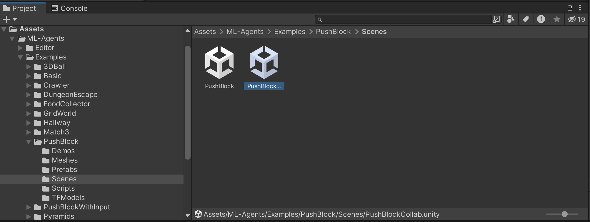
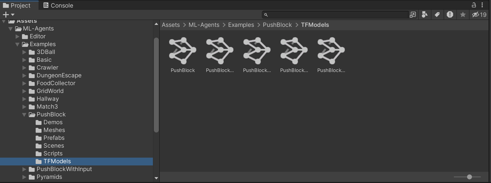
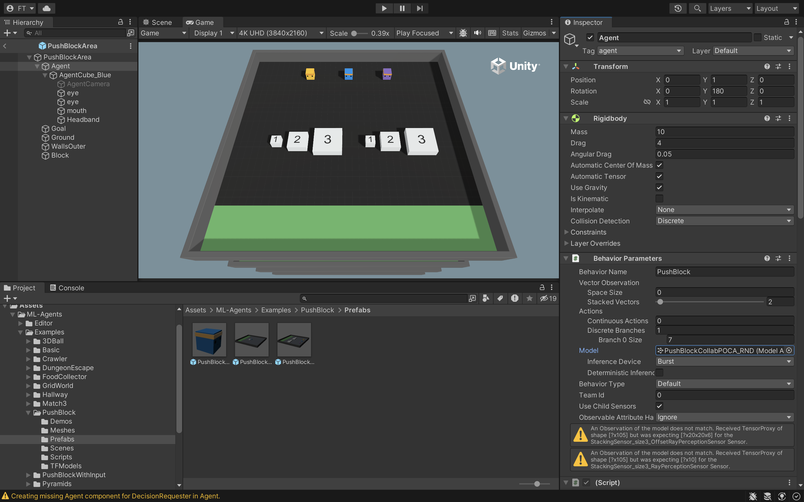

# Exploring MA-POCA+RND in Cooperative Push Block Environment

The repositorty contains three models, MA-POCA+RND, MA-POCA, and PPO for Cooperative Push Block environment. 


## Prerequisites
* Install Unity (2022.3 or later)
* Install Python (3.10.12 or higher)
* Clone this repository


## Training

If you want to do the training process you have to use either Linux or Google Colab because the environment executable file has built for linux. 

#### Google Colab
Upload the project.ipynb file on Google Colab, then upload PushBlockCollabLinux directory on Google Colab in same direcorty as project file. Create a directory called results in same directory for storing model results. Run cells in proect notebook to start the training. 

#### Linux
If you want to use Linux you only need to clone this repository and then run cells in project notebook. To prevents overwrite our model in results folder you just have to change '--run-id' parameters.

#### Notes:
* You can change hyperparameters for each model if you are interested to try different hyperparameters.


## Test Existing Model
The results directory in this repository contains three subdirectories, each subdirectory belongs to each algorithm, MA-POCA+RND, MA-POCA and PPO. You can find model (.onnx files) and also event files that contain information about each model performance.

For testing existing model on the environment you have to install Unity editor on your local machine. Then clone Unity Toolkit repository using:

```console
git clone git@github.com:Unity-Technologies/ml-agents.git
```

Follow this installation [tutorial](https://unity-technologies.github.io/ml-agents/Installation/) to install Unity ML-agents toolkit on your local machine.

Once you have done the installation, open the Unity Editor and open subdirectory of **Project** from **ml-agents** directory as a new project in Unity Editor.

Follow this path, **Assets > ML-Agents > Examples > PushBlock > Scenes** and then open **PushBlockCollab.unity**


Then, follow this path **Assets > ML-Agents > Examples > PushBlock > TFModels** and drag and drop existing **.onnx** file into **TFModels** directory.


In order to stick model to the agent, follow this path **Assets > ML-Agents > Examples > PushBlock > Prefabs**, then choose **PushBlockArea.prefab**. From top left window select **Agent**. Under **Behavior Parameters** choose the model you added recently.


Now, click on the play button to see visually how does this model perform on the environment.
